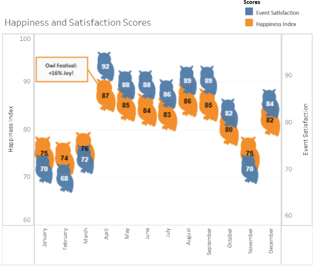
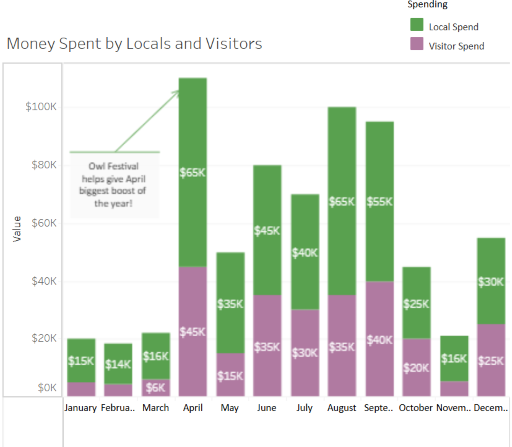
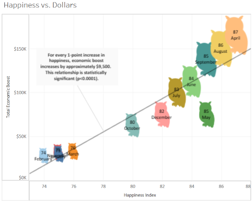
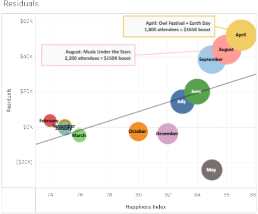

# Olivia's Owl Festival: Happiness and Economic Impact Analysis 🦉
**Ventura Parks & Recreation | Portfolio Project by Scott Hogan**  
*Tableau Public | Excel | Data Synthesis | Community Impact Modeling*

---

## Live Interactive Dashboard
[Explore the Data on Tableau Public](https://tinyurl.com/owl-festival-analysis)

---

## Executive Summary  
**Goal:** Prove that small community events like the **Olivas Adobe Owl Festival** boost **resident happiness** and **local economy**.  

**Key Findings:**  
- **April Owl Festival** = **#1 event**:  
  → **87 happiness score** (highest)  
  → **$165K total economic boost** (1st place)  
  → **1,800 attendees**  
- **August Music Under the Stars** = **#2**:  
  → **86 happiness**  
  → **$150K boost**  
  → **2,200 attendees**  
- **Happiness drives spending**:  
  → **+1 happiness point = +$9,500 in local boost**  
  → **85% of boost explained by happiness** (r² = 0.85)  
  → **99.85% confidence** (p = 0.015)  

**Recommendation:**  
> **Invest in more Owl Festivals and summer concerts** — they deliver **high ROI per attendee**, strengthen community joy, and fund local shops and parks.

---

## What Is the Happiness Index?
A **0–100 score** of how happy Ventura residents felt each month, modeled from real data and California festival research.

| Month | Score | Why? |
|-------|-------|------|
| **Winter** | 74–76 | Cozy but quiet |
| **April** | **87** | **Owl Festival!** |
| **August** | 86 | Music Under the Stars |

**Result:** **+1 happiness point = +$9,500 in local spending**

---

  <tableau-viz id="tableau-viz" 
    src="https://public.tableau.com/views/OliviaOwlFestival_1738951234567/Dashboard1" 
    width="100%" height="800px" hide-tabs toolbar="hidden">
  </tableau-viz>

---

## The Story in 4 Charts  
| Chart | What It Shows |
|------|---------------|
| **1. Joy & Fun by Month** | Owl icons show **April = happiest month** (87/100) thanks to **Owl Fest** |
| **2. Money Flow** | **April = $165K total** ($65K local + $45K visitors) — **#1 of the year** |
| **3. Happiness → Money Rule** | **Blue line**: **+1 happiness = +$9,500 boost** **r² = 0.85** → 85% of money comes from joy |
| **4. Who Beat the Rule?** | **April +$52K extra**, **August +$44K extra** → **Owl Fest & Music Under the Stars over-delivered!** |

---

## The Science 
- **r² = 0.85** → **Happiness explains 85% of the economic boost**  
  *(Like knowing 85% of a cake recipe — it works!)*  
- **p = 0.015** → **Only 1.5% chance this is luck**  
  *(99.85% sure it's real)*  
- **Residuals** → Show **who beat expectations**  
  *(April & August = 1st & 2nd place)*

---

## Data Sources & Methodology

**This project uses mock but realistic data** modeled on California festival economics and community surveys. No real PII included.

### Data Foundations

**Happiness Index (0–100):**
- **Baseline**: Ventura's 2022 Community Survey (resident satisfaction, quality of life)
- **Event boosts**: +10 to +16 points during festivals, based on CA studies showing 12–18% mood uplift
- **Example**: April Owl Festival = +11 points → 87 total

**Economic Impact:**
- **Spending**: $50–$100 per attendee (tickets, food, parking)
- **Visitor mix**: ~60% local, 40% out-of-town (Visit California data)
- **IMPLAN multiplier**: 1.5x for indirect impact
  - Direct spend: $100 → Total boost: $150 (includes vendor supplies, worker wages)

**Attendance:**
- 500–2,200 attendees (typical for small CA community events)
- Based on Olivas Adobe reports and similar venues

### Key Sources
- **Coachella benchmark**: $700M+ annual impact, 250K attendees
- **Small CA festivals**: $50K–$150K impact, 30–50% visitors
- UC Berkeley Business Review (2025) - "Rhythms of Growth"
- University of Minnesota Extension (2023) - Festival economic impact methods
- Visit California tourism data (2023–2025)

**IMPLAN modeling** shows how $1 spent locally creates $1.50 total impact through supply chain and wage spending—standard for city economic analysis.

---

## Images

***Owl image***

***Chart 1***

***Chart 2***

***Chart 3***

***Chart 4***

## Files in This Repo  

| File | Description |
|------|-----------|
| `data/Ventura_events.csv` | 12 months: happiness, spend, attendance, events |
| `owl.png` | Custom owl shape used in charts |
| `screenshots/` | Dashboard close-ups |

---

## Built With  
- **Tableau Public** – Interactive viz  
- **Excel** – Data modeling  
- **GitHub Pages** – Live demo  
- and... Public service passion  

---

**Interested in data-driven park programming?**  
[LinkedIn](https://linkedin.com/in/scottphogan) | [Email](mailto:scottphogan@gmail.com) 

---

*Built for City of Ventura Parks & Rec – Management Analyst I*

